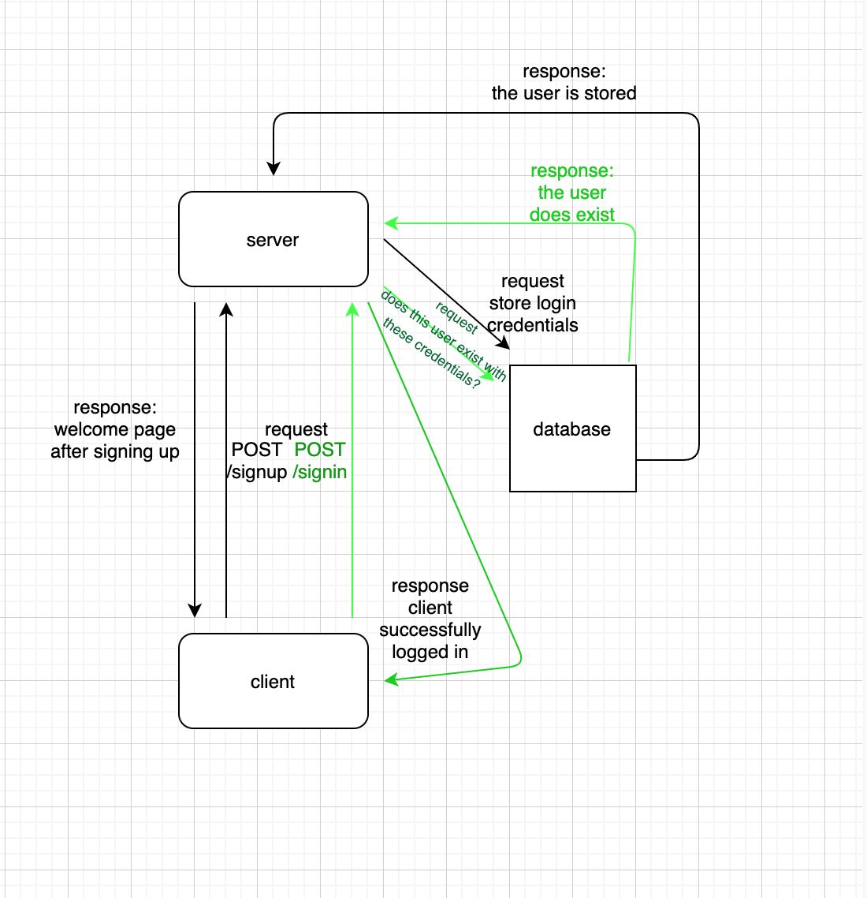

### Class 06: Lab
## Basic-Auth
### Aysia Brown

### Links & Resources
- [CI/CD](https://github.com/aysiabrown-401d39-advanced-javascript/basic-auth/actions/new)
- [Backend Server](https://aysiab-basic-auth.herokuapp.com/)
- No applicable frontend 

### Setup

**`.env` variables**
- `PORT` = port number to host your server
- `MONGO_URI` = the url to run the mongodb instance

**Installing dependencies**
- run npm i from within the cloned repo in your terminal

**Initializing & Start**
- run `nodemon` or `node index.js` from within the cloned repo in your terminal to start the server
- run `mongo` in your terminal to access your databases
    - `show dbs` will show all your databases within mongo 

**Tests**
- POST to /signup to create a new user (pass)
- POST to /signin to login as a user (use basic auth) (fail)
- Need tests for auth middleware and the routes (to be added)
- Does the middleware function (send it a basic header) (to be added)
- Do the routes assert the requirements (signup/signin) (to be added)
 
*Note:* I am still very confused on writing unit tests mocking a database using supergoose. 

**UML**
